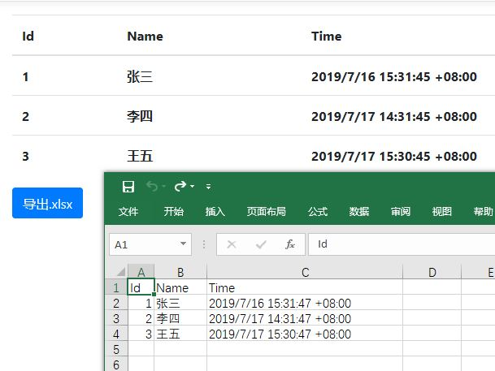
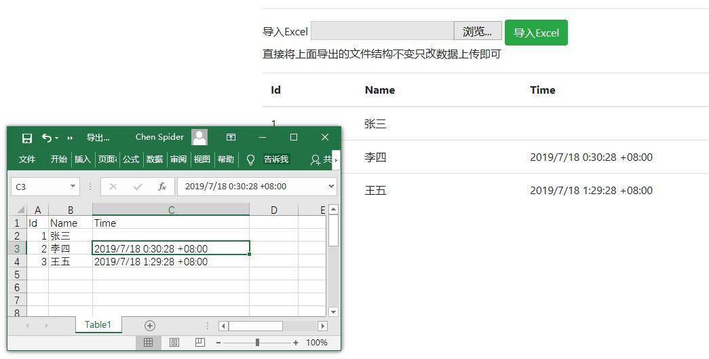

# DotNetUtility

.NET实用工具集，目前包含生成缩略图、导入导出Excel工具

跨平台，基于.NET Standard 2.0，秉承简单实用的原则，保持轻量、简洁、高内聚，拒绝复杂的结构和模式，每个.cs都能方便的独立使用

## ImageHelper.cs

基于GDI+的图像处理帮助类，基于[System.Drawing.Common包](https://www.nuget.org/packages/System.Drawing.Common/)

### 创建缩略图

根据图片生成缩放的jpg格式图片，支持自定义压缩质量

```C#
/// <summary>
/// 创建等比例缩放图，以比例更远一边为据填充另一边
/// </summary>
public static Bitmap CreateThumbnailWithPadding(this Bitmap oldImage, int newWidth, int newHeight, InterpolationMode interpolationMode = InterpolationMode.HighQualityBicubic)
/// <summary>
/// 创建等比例缩放图，以比例更接近一边为据裁剪另一边
/// </summary>
public static Bitmap CreateThumbnailWithCut(this Bitmap oldImage, int newWidth, int newHeight, InterpolationMode interpolationMode = InterpolationMode.HighQualityBicubic)
/// <summary>
/// 创建非等比例缩放图
/// </summary>
public static Bitmap CreateThumbnail(this Bitmap oldImage, int newWidth, int newHeight, InterpolationMode interpolationMode = InterpolationMode.HighQualityBicubic)
```


## NPOIHelper.cs

NPOI帮助类，主要是处理读写电子表格，基于[NPOI](https://github.com/tonyqus/npoi/)

其中使用DataSet映射Workbook、使用DataTable映射Worksheet，一般的行列结构都可以转换成DataSet/DataTable来转换成Excel

## OfficeHelper.cs

Office文件操作类，主要是处理导入、导出电子表格，基于NPOIHelper

### 导出Excel

导出Excel分两步：首先将集合基于Lambda表达式字典转换成DataTable；然后把DataTable通过NPOI转换成Excel

```C#
var dt = OfficeHelper.ToDatatable(CreateTestData1List(), new Dictionary<string, Expression<Func<TestData1, object>>> {
    { "Id",it=>it.Id },
    { "Name",it=>it.Name },
    { "Time",it=>it.Time}
});
var ds = new DataSet();
ds.Tables.Add(dt);
......
NPOIHelper.DatasetToExcel(ds, Response.Body, ExcelFormat.Xlsx);
```



### 导入Excel

导入Excel分两步：首先使用NPOI读取Excel到DataTable，然后将DataTable转换为集合

```C#
foreach (var item in OfficeHelper.ConvertFromDatatable(dt, new Dictionary<string, Func<TestData1, object, DataRow, bool>> {
    { "Id",(it,obj,row)=>OfficeHelper.TryConvertThen<int>(obj,v=>it.Id=v)},
    { "Name",(it,obj,row)=>OfficeHelper.TryConvertThen<string>(obj,v=>it.Name=v)},
    { "Time",(it,obj,row)=>OfficeHelper.TryConvertThen<DateTimeOffset>(obj,v=>it.Time=v)
    }
}))
{
    if (item.IsSuccess)
    {
        successCount++;
        testData1List.Add(item.Data);
    }
    else
    {
        messageList.Add(item.Message);
    }
}
```



# DotNetUtility.Samples.AspNet

包含演示的ASP.NET MVC项目

**请注意，出于跨平台考虑，DotNetUtility中的GDI+引用了[System.Drawing.Common包](https://www.nuget.org/packages/System.Drawing.Common/)，本项目也引用了该包，如果想保留.NET Framework中的GDI+可以将ImageHelper.cs放到自己项目里使用**

# DotNetUtility.Samples.AspNetCore

包含演示的ASP.NET Core项目，其中使用了新的DateTimeOffset来取代DateTime

# DotNetUtility.Tests

单元测试项目

---

**欢迎使用、标Star、分享、提交问题(Issue)、提交建议、贡献代码、捐赠等各种支持，也有一些关于GDI+、NPOI、表达式树、流处理的技巧值得观摩，常驻[QQ群13206038](https://jq.qq.com/?_wv=1027&k=54lzyj4)，欢迎加群交流**

Copyright (c) 2018-present, Star Chen(1402199337@qq，[techenstar@github](https://github.com/techenstar))